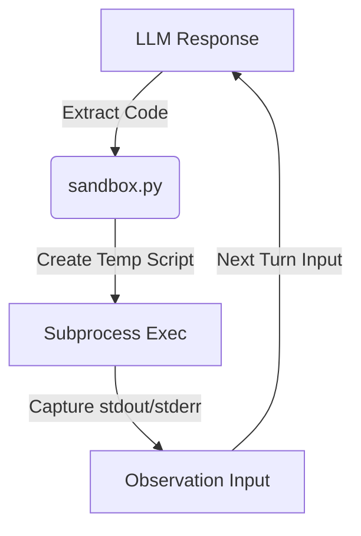
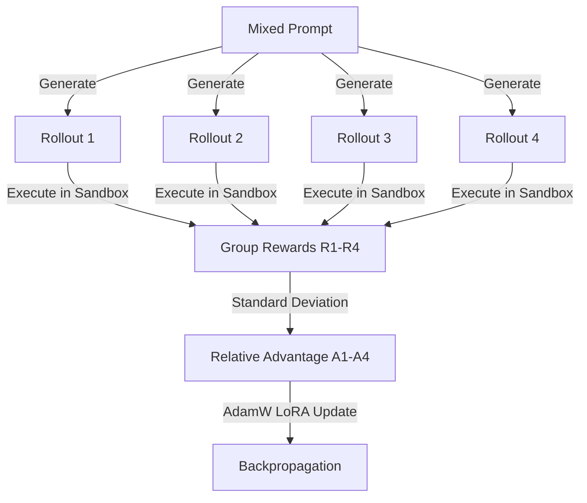
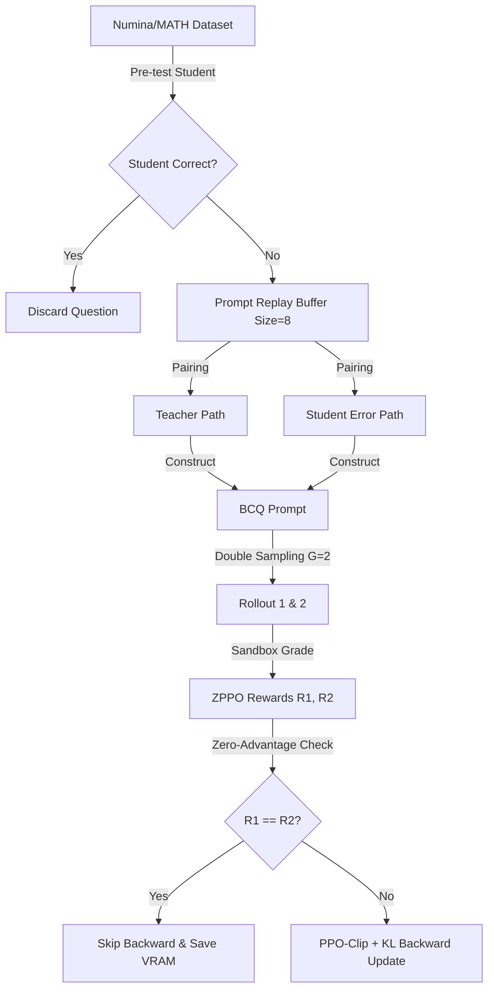

# 基于 ZPPO 强化对齐的数学推理与代码沙箱交互系统：架构与实验评估合并技术报告

> **合并说明**：本文档由以下两份文档合并整理而成，并已对照项目源代码逐项核实关键数字与机制描述：
> 1. `docs/zppo_alignment_comprehensive_final_report.md`（实验结果报告）
> 2. `docs/zppo_grpo_sandbox_comprehensive_walkthrough.md`（技术架构 Walkthrough）
>
> **项目名称**：基于 ZPPO（Zone of Proximal Policy Optimization）框架的大模型数学沙箱纠错与对齐优化
> **评测基座**：Gemma-2-2B-SFT
> **评测环境**：本地物理沙箱，支持多轮 Python 代码执行、Traceback 反馈捕获，以及大模型辅助过程评分（PRM）与步骤级奖励挽救
> **对照模型**：SFT Baseline、GRPO-1800、ZPPO-600（中期检查点）、ZPPO-960（后期检查点）

---

## 摘要

本研究评估基于教师—学生偏好课程学习的 ZPPO 强化对齐算法对小型大语言模型工具调用与数学推理能力的影响。通过在两个不同难度的测试集上对 SFT Baseline、GRPO-1800、ZPPO-600 与 ZPPO-960 进行全量评测，得出两个核心结论：

1. **早停最优点（Sweet Spot）**：在两个测试集上，ZPPO-600（中期检查点）均代表模型的最佳综合表现。训练推进至 ZPPO-960 后，模型出现明显的过拟合与风格漂移（Style Drift），其多轮调试纠错能力显著退化。
2. **工具调用行为的策略约束效应**：在 NuminaMath 混合测试集上，ZPPO 将模型的代码生成率从 28.20% 提升至 70% 以上；在 MATH Level 3 & 4 难题集上，当 SFT 与 GRPO 面对抽象问题呈现工具规避倾向、代码生成率收缩至 10%–14% 时，ZPPO 仍将代码生成率稳定在约 50%，并以 17.29% 的准确率相对超越 SFT（13.08%）与 GRPO（12.15%）。

---

## 一、系统架构与方法学

整个系统的核心前提是：使大语言模型具备类似人类程序员的"编写代码—执行—阅读报错—修复缺陷"的闭环工作流。底层的代码沙箱与判分逻辑构成全部训练与评测的物理边界。

### 1.1 物理代码沙箱与多目标奖励引擎（`core/`）



#### 1.1.1 物理沙箱的多轮交互机制（`core/sandbox.py`）

* **正则表达式提取**：当模型输出形如 `<STEP>\n```python\n# code\n```\n</STEP>` 的内容时，系统以正则表达式提取其中的 Python 代码（取最后一个 `<STEP>...</STEP>` 块，并剥离 Markdown 代码围栏）。
* **物理隔离执行**：沙箱将代码写入本地临时 `.py` 文件，通过 `subprocess` 子进程调用 Python 解释器执行（默认超时 2.0 秒），避免污染宿主机环境。执行前自动注入 `input()` 桩函数以防止子进程挂起，并强制 UTF-8 输出编码。
* **累积执行与输出回传**：多轮场景下，沙箱提取对话历史中的全部 `<STEP>` 块拼接执行（历史块以 `try/except` 包裹并过滤语法错误块，以分隔符标记最新块的输出）。执行成功时，系统将标准输出拼接为 `Observation:\n[运行结果]` 并以 User 角色回传模型；执行失败时回传完整 Traceback，模型据此在下一轮输出新的 `<STEP>` 进行调试。训练阶段每条轨迹最多交互 **3 轮**，评测阶段最多交互 **6 轮**。

#### 1.1.2 密集型多目标奖励判分系统（`core/evaluator.py`）

强化学习的奖励并非简单的 0/1 信号，而是由融合"代码规范 + 运行反馈 + 调试纠错 + 过程评分"的密集多目标奖励函数 `evaluate_multi_turn_completion` 计算：

$$\text{Total\_Reward} = \text{avg\_step\_reward} + \text{correctness\_reward} + \text{format\_penalty} + \text{length\_penalty} - \text{rep\_penalty} + \text{unclosed\_penalty} + \text{first\_step\_penalty} + \text{self\_correction\_bonus}$$

八个奖励子项的定义如下（数值均经代码核实）：

1. **首轮强制编码惩罚（`first_step_penalty`）**：模型第一轮输出必须包含 `<STEP>` 标记；若第一轮未生成代码而直接以纯文本作答，扣除 **$-0.5$**。
2. **格式绕过惩罚（`format_penalty`）**：若模型未将代码置于 `<STEP>` 标签内，而以裸 ` ```python ` 代码块形式输出以绕过沙箱，扣除 **$-0.15$**。
3. **标签未闭合惩罚（`unclosed_penalty`）**：若生成结束时 `</STEP>` 标签未闭合，系统自动补全，但扣除 **$-0.1$**。
4. **沙箱执行奖励/惩罚（`avg_step_reward`）**：对每个 `<STEP>` 代码块进行语法校验（AST 解析）与累积执行校验；运行成功计 **$+0.1$**，语法错误或运行报错计 **$-0.1$**，最终取所有步骤的均值。
5. **调试纠错奖励（`self_correction_bonus`）**：若前一步代码执行失败，模型依据沙箱返回的 Traceback 在后续步骤写出可成功执行的代码，判定为纠错成功，额外奖励 **$+0.2$**。
6. **长度惩罚（`length_penalty`）**：为抑制冗长输出，扣除 **$-0.00001 \times \text{字符总数}$**。
7. **重复惩罚（`rep_penalty`）**：检测以下三类重复模式——连续 25 个相同符号字符（字符集为 `.-_*+=#~`）、2–3 字符符号组合连续重复 7 次及以上、长度大于 15 的相同行连续出现 5 行及以上；命中任一即扣除 **$-0.2$**。
8. **核心正确性奖励与指数折扣（`correctness_reward`）**：
   * *确定性答案比对*：提取执行输出，经字符串规范化、浮点相对误差（1% 以内）与 SymPy 符号化简三级比对。若答案正确且代码通过 AST 反作弊检查（排除仅打印字面常数的"常数打印"作弊代码），给予满分 **$+0.9$**。
   * *PRM 过程评分与步骤奖励挽救*：若比对失败且格式合规，调用大模型辅助过程判分接口（按 0.0 / 0.15 / 0.30 / 0.40 / 0.50 五档阶梯评分）。训练侧存在两种折算实现（详见附录 A.2）：`core/evaluator.py` 中将过程分统一折算为 $\text{salvage\_score} \times (0.9 / 0.5) \times \text{Discount}$（过程分 0.50 对应折算为满分 0.9）；`zppo/train_zppo.py` 中则以 **0.50** 为阈值，过程分 $\ge 0.50$ 时记满分 1.0，否则将 $\text{PRM 评分} \times 2.0$ 作为梯度引导奖励。
   * *指数折扣（Discount）机制*：为鼓励模型以最简洁的步骤完成求解，正确性奖励乘以折扣系数：
     $$\text{Discount} = 0.8^{\text{报错次数}} \times 0.9^{\text{代码步骤数} - 1}$$
     执行报错次数越多、代码步骤越冗长，最终得分的折损越严重。

### 1.2 GRPO 组相对优势强化训练管线（`grpo/`）

传统 PPO 需要额外训练庞大的 Critic（价值评估）网络，在显存受限环境下极易溢出。本项目的 GRPO 实现以**组内相对指标**取代 Critic。



#### 1.2.1 组内四通道采样（Group Size $G=4$）

从混合数值训练集 `numina_gsm_mix_numeric.jsonl` 中抽取题目，使用当前 LoRA 策略模型对同一问题进行 **4 次探索采样**（`temperature=0.7`，`top_p=0.9`，`repetition_penalty=1.2`，单轮 `max_new_tokens=512`），生成 4 条不同的解题轨迹。每条轨迹在沙箱中最多自主交互 **3 轮**（`max_turns=3`）。

#### 1.2.2 相对优势计算

交互结束后，由 1.1.2 节的判分器得到 4 个密集奖励值 $[R_1, R_2, R_3, R_4]$，计算组内均值 $\bar{R}$ 与标准差 $\sigma_R$，优势函数为：

$$A_i = \frac{R_i - \bar{R}}{\sigma_R + 10^{-8}}$$

若 $\sigma_R < 10^{-8}$（组内奖励几乎无差异），优势直接置零。

#### 1.2.3 不执行零优势跳过（No Zero-Advantage Skip）

这是本 GRPO 实现的关键设计：即使 4 条轨迹得分完全相同（优势全为 0），**训练仍执行 `loss.backward()` 与 `optimizer.step()`**，不跳过反向传播。此时 PPO 策略梯度项为零，梯度完全由 KL 散度约束项驱动，强制 LoRA 权重向 SFT 参考模型收敛，构成防止风格漂移的策略安全阀。[^1]

#### 1.2.4 梯度回传与 LoRA 对齐

通过 `with model.disable_adapter()` 临时关闭 LoRA 适配器以获得参考模型对数概率（Reference Logprobs），再以启用适配器的当前策略获得 Active Logprobs，仅对 Response 区段的 Token 计算 PPO-Clip 与 KL 联合损失：

$$\mathcal{L} = \text{Clip}\big(r_t(\theta),\, A_i,\, \epsilon\big) + \beta \cdot \text{KL}\big(\pi_\theta \,\|\, \pi_{\text{ref}}\big), \qquad \epsilon = 0.2,\ \beta = 0.01$$

随后执行梯度累加与 AdamW 步进（学习率 $1\times10^{-6}$）。训练上限为 1800 步，每 20 步保存检查点，序列长度上限为 1664。

### 1.3 ZPPO 错题反思回放强化管线（`zppo/`）

面对 Level 3 & 4 难题时，原生 GRPO 探索极易出现"组内轨迹全部错误且均不得分"的冷启动困境：此时优势全为零，模型缺乏正向信号，倾向于退回纯文本作答，工具调用行为逐渐消退。ZPPO 引入**偏好重放缓冲区与反思课程学习**以解决该问题。



#### 1.3.1 动态错题重放缓冲区（Prompt Replay Buffer, PRB）

* **入池筛选**：新题入池前，先由学生模型以贪婪解码进行预考（最多 3 轮沙箱交互）。若首轮即正确，判定题目过于简单而直接过滤，以节省算力；若做错，则判定为有效训练样本正式入池。
* **偏好配对**：PRB 记录学生的真实错误轨迹（$y_{\text{student}}$，最多保留最近 3 条），同时由确定性教师模型（DeepSeek API，`temperature=0.0`，最多 3 轮沙箱交互）生成正确的标准代码轨迹（$y_{\text{teacher}}$）。
* **容量与存盘**：缓冲区容量为 **8** 题（`BUFFER_SIZE=8`）。池内各题的掌握进度、停留步数与轨迹等状态在每一步训练后写入 `zppo_prb_state.json`，支持断点恢复。
* **训练起点**：ZPPO 训练以 GRPO-1800 检查点（`checkpoint_step1800_v3`）为初始适配器继续优化，训练上限 1000 步，每 20 步保存检查点，优化器为 AdamW（学习率 $5\times10^{-6}$，权重衰减 0.01）。

#### 1.3.2 双候选对比反思模板（BCQ）

训练时从缓冲池抽题，将 Candidate A（$y_{\text{student}}$）与 Candidate B（$y_{\text{teacher}}$）随机打乱顺序（消除位置偏置），构成 **BCQ（Bi-candidate Comparison Query）提示词**：要求模型比较两份候选解答、指出错误候选的出错位置并说明原因，随后写出正确的推理过程并在 `<STEP>` 中输出正确代码。模型在强化探索前须先完成"自我批判"，从而模仿教师的正确工具调用路径。

#### 1.3.3 双采样与零优势跳过（Zero-Advantage Skip）

* **双通道采样（$G=2$）**：对 BCQ 提示词并行采样 2 条探索轨迹（`temperature=0.7`，`top_p=0.9`），经沙箱判分获得两个奖励值。ZPPO 侧奖励为：本地确定性比对通过记 1.0；否则调用 PRM 过程评分，得分 $\ge 0.50$ 记 1.0，得分 $< 0.50$ 记 $\text{PRM 评分} \times 2.0$；未生成代码块记 0.0。
* **优势计算**：$A_i = R_i - \bar{R}$（组内均值基线，无标准差归一化）。
* **零优势跳过**：若两条轨迹的奖励相同（优势全为零），系统**完全跳过本步的 `backward()` 与 `optimizer.step()`**。其依据是：BCQ 模板下教师轨迹已提供显式的强引导，无需再依赖 KL 项进行频繁的风格约束，跳过零优势步骤可显著节约难题训练中的无效算力（原文档估计节约幅度超过 30%）。[^1]

#### 1.3.4 双通道前向强化更新与标签遮罩

若两条轨迹得分不同，则先冻结旧策略对数概率（`token_lp_old`，更新前采集），再进行双通道前向计算：

* **通道一**：启用 LoRA 适配器，获得新策略概率 `token_lp_theta`；
* **通道二**：通过 `with model.disable_adapter()` 屏蔽 LoRA，获得 SFT 参考概率 `token_lp_ref`。

随后构造 Token 级遮罩（Prompt 区段置 0），**仅在 Response 区段**（模型输出的反思与代码 Token，含终止符）计算 PPO-Clip 剪切损失与 KL 惩罚并回传，仅更新 LoRA 适配器参数：

$$\mathcal{L}_{\text{token}} = -\min\big(r_t A,\ \text{clip}(r_t, 1-\epsilon, 1+\epsilon) A\big) + \beta \cdot \text{KL}_t, \qquad \epsilon = 0.2,\ \beta = 0.01$$

#### 1.3.5 缓冲区的新陈代谢（毕业与退休）

每个训练步结束时，PRB 自动清理：

* **毕业（Graduate）**：某题被学生模型连续 **2 次**（`GRAD_THRESHOLD=2`）试考做对，判定已掌握，移出缓冲池；
* **退休（Retire）**：某题在池内停留 **5 步**（`MAX_STEPS=5`）仍未被做对，为防止训练停滞，强制移出缓冲池；
* 系统自动补入新错题，维持缓冲区动态更新。

### 1.4 自动化评测与恢复管线（`evaluation/` 与 `scripts/`）

评测是检验强化训练是否引发对齐税（Alignment Tax）或格式坍塌（Formatting Collapse）的最终环节。

#### 1.4.1 评测配置

两套评测脚本（`run_bench500.py`、`run_hard_math.py`）采用统一配置：**贪婪解码**（`do_sample=False`）、最多 **6 轮**沙箱交互、单轮 `max_new_tokens=1024`、`repetition_penalty=1.2`；正确性判定先执行确定性比对，失败时调用 PRM 过程评分，**挽救阈值取 $\ge 0.40$**。

#### 1.4.2 断点恢复机制

评测主进程内置断点恢复：每次启动时自动读取目标结果文件（如 `bench500_{model}.json`、`bench250_hard_{model}.json`）中已存盘的记录数 $N$，自动跳过前 $N$ 题，从第 $N+1$ 题继续评测，每完成一题即写盘，避免重复评测造成的算力损耗。此外，`scripts/run_zppo_recovery.ps1` 为 ZPPO **训练**进程提供崩溃自动重启循环（检测到非零退出码时等待 5 秒后重启，训练脚本自动加载最新检查点无缝续训）；`scripts/run_pipeline.ps1` 则串联"续训至 1000 步 → 500 题基准评测 → 汇总报告生成"三阶段流水线。

#### 1.4.3 几何题内存过滤（Post-Filtering）

纯文本条件下模型无法对几何图形建立精确的空间表示，几何题中的 `[asy]`（Asymptote 矢量绘图代码）对代码生成策略构成显著的格式噪声。评测结束后，报告生成器在内存中按 `type != "geometry"` **过滤剔除 36 道几何题**（250 题切片 → 保留 **214 题**），仅保留纯代数、数论与概率计算题，再计算准确率、代码生成率及多轮调试挽救率，编译生成最终对比报告。[^2]

### 1.5 核心工程要点汇总

| 阶段 | 核心技术点 | 解决的问题 |
| :--- | :--- | :--- |
| 判分（`core/`） | 密集多目标评估 + 指数折扣 | 抑制冗余与重复输出，奖励调试纠错行为，惩罚冗长代码 |
| GRPO（`grpo/`） | $G=4$ 组内相对评估 + KL 约束回传（无零优势跳过） | 免除 Critic 网络以节省显存，组内无差异探索时依靠 KL 项维持风格稳定 |
| ZPPO（`zppo/`） | BCQ 错题反思模板 + 零优势跳过（$G=2$） | 缓解难题下的冷启动探索困境，优势为零时跳过反向传播以节约算力 |
| 评测（`evaluation/`） | 断点恢复 + 几何题内存过滤 | 避免中断后的重复评测，排除几何绘图代码对数学推理评测的噪声干扰 |

---

## 二、实验结果

### 2.1 实验一：NuminaMath 混合测试集（500 题全量评测）

该测试集用于评估模型在基础代数与应用题上的对齐稳定性与防过拟合鲁棒性。表中每列最优值以**加粗**标示。

| 评测维度 | SFT Baseline | GRPO-1800 | ZPPO-600（中期） | ZPPO-960（后期） |
|---|---|---|---|---|
| 准确率 Accuracy | 29.40% (147/500) | 29.20% (146/500) | **32.60% (163/500)** | **32.60% (163/500)** |
| 代码生成率 Code Gen | 28.20% (141/500) | 36.40% (182/500) | 71.20% (356/500) | **74.40% (372/500)** |
| 代码块执行成功率 | **65.69%** (134/204) | 64.73% (167/258) | 63.03% (358/568) | 60.94% (351/576) |
| 过程分挽救题数 | - | - | **34 题** | 31 题 |
| 答对题目中的写码比例 | 36.73% (54/147) | 47.95% (70/146) | 75.46% (123/163) | **79.75% (130/163)** |
| 写码题目的正确率 | **38.30%** (54/141) | **38.46%** (70/182) | 34.55% (123/356) | 34.95% (130/372) |
| 不写码题目的正确率 | 25.91% (93/359) | 23.90% (76/318) | **27.78%** (40/144) | 25.78% (33/128) |
| 首轮即正确率 | 10.40% (52/500) | 13.00% (65/500) | 23.00% (115/500) | **23.80% (119/500)** |
| 纠错机会数（首轮报错） | 38 次 | 45 次 | 92 次 | 103 次 |
| 二轮调试执行成功率 | 47.37% (18/38) | 33.33% (15/45) | **52.17%** (48/92) | 47.57% (49/103) |
| 纠错最终挽救率 | 5.26% (2/38) | **11.11%** (5/45) | 8.70% (8/92) | 10.68% (11/103) |

#### 核心结论

1. **代码生成与得分能力绑定**：SFT 答对题目中仅 36.73% 依赖代码执行，而 ZPPO-960 答对题目中的写码比例升至 79.75%，代码执行成为 ZPPO 模型的核心得分来源。
2. **写码题目的胜率优势**：所有模型写码题目的正确率（34%–38%）均显著高于不写码题目（23%–27%），表明沙箱交互在复杂推理中起到了确定性的误差抑制作用。
3. **960 步后的纠错能力退化**：ZPPO-960 的首轮即正确率最高（23.80%），但其二轮调试成功率（47.57%）与代码执行成功率（60.94%）均低于中期的 ZPPO-600。训练后期模型出现过度写码、重复性无效调试循环与虚假报错诊断，表明 600 步为更优的早停检查点。

### 2.2 实验二：MATH Geometry-Free 难题测试集（214 题全量评测）

为评估模型在脱离简单文字题红利后的纯逻辑推理上限，本实验从 MATH（Level 3 & 4）250 题切片中剔除 36 道高度依赖视觉理解与坐标建系的几何题，保留 **214 道纯代数、数论与概率题**进行全量评测。

| 评测维度 | SFT Baseline | GRPO-1800 | ZPPO-600（中期） | ZPPO-960（后期） |
|---|---|---|---|---|
| 准确率 Accuracy | 13.08% (28/214) | 12.15% (26/214) | **17.29% (37/214)** | 14.95% (32/214) |
| 代码生成率 Code Gen | 14.02% (30/214) | 10.28% (22/214) | 49.07% (105/214) | **51.87% (111/214)** |
| 代码块执行成功率 | **53.70%** (29/54) | 52.50% (21/40) | 42.79% (89/208) | 45.85% (94/205) |
| 过程分挽救题数 | - | - | **8 题** | 7 题 |
| 答对题目中的写码比例 | 14.29% (4/28) | 15.38% (4/26) | **48.65%** (18/37) | 43.75% (14/32) |
| 写码题目正确率 | 13.33% (4/30) | **18.18%** (4/22) | 17.14% (18/105) | 12.61% (14/111) |
| 不写码题目正确率 | 13.04% (24/184) | 11.46% (22/192) | 17.43% (19/109) | **17.48%** (18/103) |
| 首轮即正确率 | 0.93% (2/214) | 1.40% (3/214) | 5.14% (11/214) | **5.61% (12/214)** |
| 纠错机会数（首轮报错） | 12 次 | 9 次 | 46 次 | 46 次 |
| 二轮调试修改成功率 | **50.00%** (6/12) | 44.44% (4/9) | 39.13% (18/46) | 36.96% (17/46) |
| 纠错最终挽救率 | **16.67%** (2/12) | 11.11% (1/9) | 15.22% (7/46) | 4.35% (2/46) |

#### 分学科（Subject）准确率对比

| 学科 Type | 样本数 | SFT Baseline | GRPO-1800 | ZPPO-600 | ZPPO-960 |
|---|---|---|---|---|---|
| Algebra（代数） | 35 题 | **28.57%** (10/35) | **28.57%** (10/35) | **28.57%** (10/35) | **28.57%** (10/35) |
| Counting & Probability（计数与概率） | 35 题 | 2.86% (1/35) | 2.86% (1/35) | **8.57%** (3/35) | **8.57%** (3/35) |
| Intermediate Algebra（中级代数） | 36 题 | 5.56% (2/36) | 8.33% (3/36) | **16.67%** (6/36) | 13.89% (5/36) |
| Number Theory（数论） | 36 题 | **13.89%** (5/36) | 8.33% (3/36) | 11.11% (4/36) | 5.56% (2/36) |
| Prealgebra（初等代数） | 37 题 | 16.22% (6/37) | 21.62% (8/37) | **29.73%** (11/37) | 24.32% (9/37) |
| Precalculus（微积分预备） | 35 题 | **11.43%** (4/35) | 2.86% (1/35) | 8.57% (3/35) | 8.57% (3/35) |

#### 核心结论

1. **难题场景下的工具规避倾向**：在 Level 3 & 4 难题上，SFT（14.02%）与 GRPO（10.28%）因缺乏强偏好约束，代码生成率严重收缩，绝大多数题目退回纯文本推理，整体准确率被限制在 12%–13% 区间。ZPPO 策略模型则克服了该倾向，将代码生成率稳定锚定在 50% 左右。
2. **ZPPO-600 的显著领先（+5.14% / +4.21%）**：剔除几何噪声后，ZPPO-600 取得 17.29% 的最高准确率，证明强制工具调用与反思课程训练能够在难题区间建立实质性的推理能力优势。
3. **ZPPO-960 纠错挽救能力的系统性衰退（15.22% → 4.35%）**：首轮代码报错后，ZPPO-600 有 15.22% 的题目可通过多轮调试最终做对；而 ZPPO-960 的挽救率骤降至 4.35%（46 次报错仅挽救 2 题）。这表明后期强化训练对策略模型造成了显著的对齐偏置，使其调试逻辑趋于刻板，陷入重复性修正循环，纠错能力基本丧失。
4. **反思训练对纯文本推理的正向迁移**：ZPPO-600 不写码题目的正确率（17.43%）显著高于 SFT（13.04%）与 GRPO（11.46%），说明 BCQ 反思比对训练不仅优化了代码调用行为，还改善了模型底层的推理先验，使其纯文本推理的严谨性同步提升。

---

## 三、结论与未来工作

1. **早停检查点的普适性**：无论混合题集还是难题集，2B 规模模型在强化训练约 **600 步**时达到推理能力与泛化鲁棒性的最佳平衡点。继续训练至 960 步虽能小幅提升首轮即正确率（23.80% vs 23.00%；5.61% vs 5.14%），但会导致调试纠错模块（调试成功率与挽救率）的严重退化。
2. **几何题对纯文本沙箱评测的噪声污染**：实验表明，含 `[asy]` 绘图代码的几何题在缺乏多模态输入时对代码生成策略构成显著惩罚（强制坐标建系极易产生累积误差）。构建物理沙箱评测集时，必须将"多模态依赖"与"纯逻辑计算"题目严格解耦。
3. **后续改进方向**：
   * **动态 KL 惩罚控制**：在训练后期自适应增大 $\beta$ 系数，以抑制语言风格漂移，防止多轮纠错能力崩溃；
   * **多轮调试专用奖励**：在奖励设计中，除最终结果外，对"首轮报错后第二轮调试运行成功"这一纠错行为给予小额正向塑形奖励（Shaping Reward）。

---

## 附录 A：文档间矛盾与代码核实说明

[^1]: **GRPO 与 ZPPO 采样机制的表述矛盾（已按代码修正）**：原《实验结果报告》方法学一节将"$G=2$ 采样 + 零优势跳过"标注为"GRPO Baseline"特性。经代码核实，实际实现为：GRPO（`grpo/train_grpo.py`）采用 **$G=4$** 组采样且**不执行零优势跳过**（优势全零时仍由 KL 项驱动反向传播）；ZPPO（`zppo/train_zppo.py`）采用 **$G=2$** 双采样且**执行零优势跳过**（组内奖励一致时完全跳过反向传播）。本文档已统一为代码的实际实现。

[^2]: **几何题剔除数量的代码注释偏差**：`evaluation/run_hard_math.py` 自动生成的报告头部字符串写作"剔除 35 道几何题，保留 215 道"，与该脚本实际过滤结果不符；按学科分布数据（各学科样本数合计 214）与原结果报告，实际为**剔除 36 道、保留 214 道**，本文档采用后者。

其余核实中发现但已在正文按代码修正的次要偏差不逐一脚注，主要包括：（a）`core/evaluator.py` 中 PRM 过程分的折算系数为 $0.9/0.5=1.8$ 且该路径不设显式阈值，"0.50 阈值 + $\times 2.0$ 折算"仅存在于 `zppo/train_zppo.py` 的学生奖励函数中（正文 1.1.2 与 1.3.3 已分别如实描述）；（b）原 Walkthrough 将评测断点恢复机制归于 `run_zppo_recovery.ps1`，实际该脚本为训练崩溃重启循环，评测断点恢复内建于两个评测 Python 脚本本身（正文 1.4.2 已修正）；（c）评测阶段的 PRM 挽救阈值为 0.40（`SALVAGE_THRESH=0.40`），与训练侧的 0.50 阈值不同，原文档未提及，正文 1.4.1 已补充。
