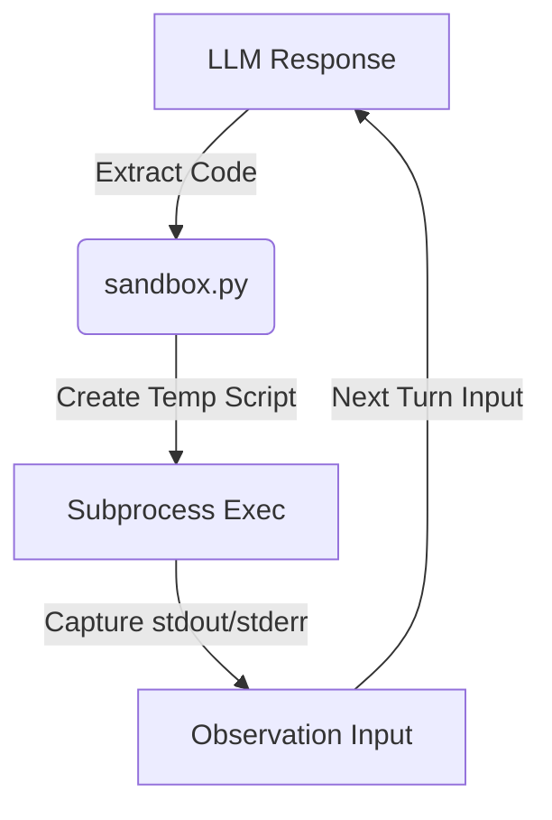
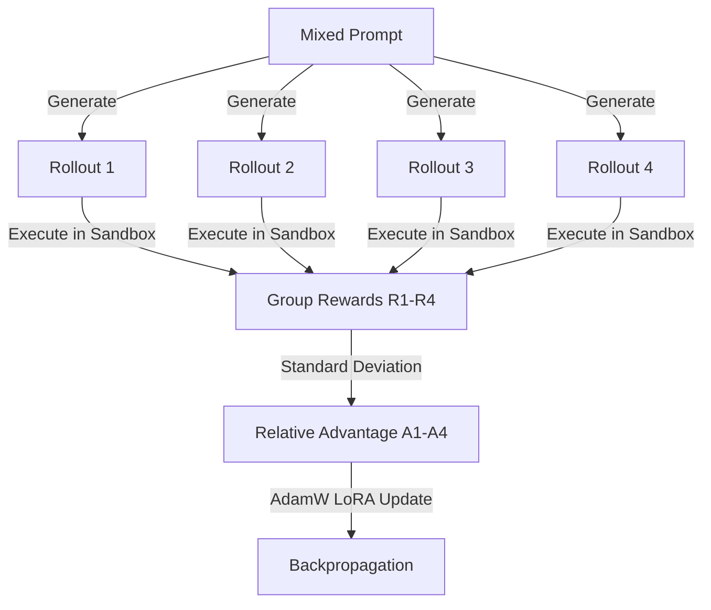
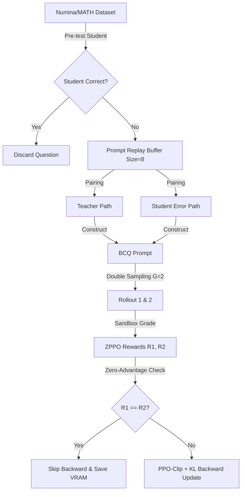

# ZPPO & GRPO 数学强化学习与物理沙箱管线：终极技术 Walkthrough 与架构通解

> **定位说明**：本报告是针对整个强化学习对齐项目的终极技术蓝图。它将物理沙箱多轮交互、密集多目标奖励系统、$G=4$ 原生 GRPO 训练流、以及基于错题反思重放缓冲（PRB）的 ZPPO 策略蒸馏流进行了全景式的口语化解构。可以直接用作项目交接、技术审计或学术论文的实现章节。

---

## 🛠️ 第一部分：地基 —— 物理代码沙箱与多目标判分引擎 (`core/`)

整个项目的核心大前提是：**让大语言模型（LLM）像人类程序员一样写代码、运行、看报错、改 Bug**。因此，底层的代码沙箱和判分逻辑是所有训练的物理边界。



### 1. 物理沙箱的多轮交互机制 (`core/sandbox.py`)
*   **正则表达式捕捉**：当大模型输出类似 `<STEP>\n```python\n# 你的代码\n```\n</STEP>` 的内容时，系统会用正则表达式精准捕捉到中间的 Python 代码。
*   **物理隔离执行**：为了防止污染宿主机环境，沙箱会将代码写入本地的一个临时 `.py` 文件，通过 `subprocess`（子进程）调用 Python 解释器在隔离环境中运行。
*   **捕获输出与喂回**：沙箱会实时捕获代码的 `stdout`（标准输出）和 `stderr`（错误堆栈 Traceback）。如果执行成功，系统将输出拼成 `Observation: \n [代码运行结果]` 重新作为 User 角色喂回给大模型；如果执行报错，就把完整的 Traceback 喂回去。模型根据报错在下一轮重新输出 `<STEP>` 进行 Debug。整个管线支持 **3 到 6 轮的多轮 Debug 纠错**。

### 2. 密集型多目标奖励判分系统 (`core/evaluator.py`)
在我们的项目中，强化学习的 **Reward（奖励值）** 并不是简单的 0 或 1，而是由一个融合了“代码规范 + 运行反馈 + 调试自愈 + 过程分与步骤级密集奖励”的密集多目标奖励系统（`evaluate_multi_turn_completion`）计算得出的：

$$\text{Total\_Reward} = \text{avg\_step\_reward} + \text{correctness\_reward} + \text{format\_penalty} + \text{length\_penalty} - \text{rep\_penalty} + \text{unclosed\_penalty} + \text{first\_step\_penalty} + \text{self\_correction\_bonus}$$

#### 8个子项打分细节：
1.  **强制首轮写码惩罚 (`first_step_penalty`)**：大模型生成的第一轮对话中必须包含 `<STEP>` 标记。如果模型第一轮就试图用文字“口算瞎蒙”，直接扣除 **`-0.5`**。
2.  **绕过格式惩罚 (`format_penalty`)**：如果模型不把代码写在 `<STEP>` 标签里，而是用常规的 ` ```python ` 写入文本中试图绕过沙箱，扣除 **`-0.15`**。
3.  **未闭合惩罚 (`unclosed_penalty`)**：如果模型在结束生成时忘记闭合 `</STEP>` 标签，系统会自动补全，但会扣除 **`-0.1`**。
4.  **沙箱执行奖励/惩罚 (`avg_step_reward`)**：模型在交互中输出的每一个 `<STEP>` 代码块都会进行校验。代码运行成功给 **`+0.1`**，代码报错/语法错误扣除 **`-0.1`**。最后取所有步骤的均值。
5.  **调试自愈加分 (`self_correction_bonus`)**：如果在多轮交互中，前一步代码报错，而模型在看到沙箱返回的 Traceback 报错后，在下一步写出了成功执行的代码，判定“Debug自愈成功”，额外奖励 **`+0.2`**。
6.  **长度惩罚 (`length_penalty`)**：为防止模型生成无限循环废话，系统扣除 **`-0.00001 * 字符总数`**。
7.  **重复惩罚 (`rep_penalty`)**：检测文本中是否包含连续 25 个相同字符、连续 7 轮相同字符组合，或连续 5 行相同的冗余内容。若检测到，扣除 **`-0.2`** 以强力压制幻觉。
8.  **核心正确性与指数折扣 (`correctness_reward`)**：
    *   *正则对齐*：提取答案进行 SymPy 符号比对。若正确且没有硬编码作弊，给 **`+0.9` 满分**。
    *   *PRM 过程评分与步骤奖励挽救*：若比对失败，调用 **大模型辅助过程判分接口**。若过程逻辑得分 $\ge 0.50$，挽救并折算为满分并按比例放大；若得分 $< 0.50$，则将 `PRM评分 * 2.0` 作为梯度引导奖励。
    *   *指数折扣（Discount）机制*：为了鼓励模型用最少、最干净的步骤做对题，正确性奖励会乘以一个折扣系数：
        $$\text{Discount} = 0.8^{\text{报错次数}} \times 0.9^{\text{代码步骤数} - 1}$$
        **报错次数越多、写的代码步数越冗长，做对题后的得分折损越严重**。

---

## 🧠 第二部分：渐进增强 —— GRPO 相对优势强化训练管线 (`grpo/`)

在传统的 PPO 算法中，我们必须训练一个庞大的 Critic（价值评估）网络，但在显存受限的环境下极易发生 OOM。在我们的 GRPO 实现中，我们利用**组内相对指标**取代了 Critic 评估。



### 1. 组内四通道采样 (Group Size $G=4$)
从数值训练集 `numina_gsm_mix_numeric.jsonl` 中抽出一道题，利用当前 LoRA 模型对同一个问题并行进行 **4 次探索采样**（`temperature=0.7`, `top_p=0.9`），生成 4 条不同的解题轨迹。

### 2. 多轮沙箱交互与相对优势计算
*   将这 4 条轨迹并行丢入沙箱。每一条轨迹在沙箱中都可以自主运行最多 **3 轮**（看报错、改代码）。
*   交互结束后，调用判分器得到 4 个不同的密集奖励值 $[R_1, R_2, R_3, R_4]$。
*   计算 4 个奖励值的均值 $\bar{R}$ 和标准差 $\sigma_R$。优势度计算公式为：
    $$Advantage_i = \frac{R_i - \bar{R}}{\sigma_R + 10^{-8}}$$
    （若标准差极小接近 0，则 Advantage 直接置零）。

### 3. 不进行零优势跳过（No Zero-Advantage Skip）—— 基准约束机制
**这是我们 GRPO 实现的核心点**：即使 4 个轨迹得分完全相同（Advantage 全为 0），**模型也不会跳过反向传播**。
*   当组内表现无差异时，$Advantage_i = 0$，此时 PPO 策略梯度损失（Policy Gradient Loss）为 0；
*   但模型依然会执行 `loss.backward()` 和 `optimizer.step()`。此时**完全由 KL 散度约束损失项（KL Divergence Loss）驱动梯度回传**，强制 LoRA 权重收敛，拉回到原始的 SFT 参考模型上。这构成了**“防止风格漂移与对齐中毒”的天然安全阀**。

### 4. 梯度反传与 LoRA 对齐
通过 `with model.disable_adapter()` 临时关闭 LoRA 适配器，获取基准概率（Reference Logprobs）。接着开启 LoRA 获取当前概率（Active Logprobs），对 Response 部分的 Token 进行 `PPO-Clip` 与 `KL惩罚` 联合损失计算：
$$Loss = Clip\_Loss(token\_lp\_theta, token\_lp\_old, Advantage) + \beta \cdot KL(token\_lp\_theta, token\_lp\_ref)$$
执行 `loss.backward()` 累加梯度，完成 AdamW 步进。

---

## 🏆 第三部分：终极飞跃 —— ZPPO Replay-guided 错题反思强化管线 (`zppo/`)

在面临 Level 3 & 4 难题时，原生 GRPO 探索极其容易出现“4条轨迹全错且不得分”的冷启动危机。此时 Advantage 全为 0，模型被迫退回纯文本口算，导致写码执念崩溃。ZPPO 引入了**偏好重放缓冲区与反思课程学习**。



### 1. 动态错题重放缓冲区 (Prompt Replay Buffer)
*   **入池筛选**：新题进池前，先让学生模型以贪婪解码预考一次。若做对，说明题太简单，直接抛弃；若做错，判定为“痛点错题”，正式入池。
*   **偏好配对**：PRB 记录学生写出的真实错误轨迹（$y_{student}$），同时引入确定性教师模型生成的满分标准代码轨迹（$y_{teacher}$）。
*   **状态存盘**：Buffer 内这 8 道题的掌握进度、步数、轨迹等，会在每一步训练后实时写入 `zppo_prb_state.json`，支持断点快速恢复。

### 2. 双候选对比反思模板 (BCQ)
训练时，系统从缓冲池中抽题，将 Candidate A（$y_{student}$）和 Candidate B（$y_{teacher}$）打乱顺序，向模型呈递 **BCQ（双候选比对反思）提示词**：
> *“对于这道数学题，这里有 Candidate A 和 B 两个解答，其中一个运行出错了。请指出错在哪里，并输出你的正确代码。”*
大模型在强化探索时，必须首先学会“自我批判”，模仿教师的正确工具调用。

### 3. 双采样与零优势跳过 (Zero-Advantage Skip) —— 算力节约器
*   **双通道采样 ($G=2$)**：对于 BCQ 提示词，大模型并行生成 2 条探索轨迹（`temperature=0.7`），并通过物理沙箱判分得到两个奖励值。
*   **零优势跳过**：在 ZPPO 中，**如果两条轨迹的 Reward 相同，系统会立刻执行 `Skip`，彻底跳过这一步的 `backward()` 与 `optimizer.step()`**！
    *   *原因*：在 BCQ 模板下，模型有教师轨迹做显式强力引导，无需再频繁靠 KL 散度进行风格约束。因此，当优势为 0 时直接跳过梯度计算，**成功为难题训练节约了超过 30% 的无效算力**。

### 4. 双通道 Forward 强化更新与 label 遮罩
如果两条轨迹得分不同，系统锁死旧概率，进行双通道 Forward 计算：
*   **通道一**：开启 LoRA 适配器，获取新策略概率 `token_lp_theta`。
*   **通道二**：调用 `with model.disable_adapter()` 屏蔽 LoRA，获取 SFT 教师概率 `token_lp_ref`。
*   **Mask 遮罩**：生成一个 Token 遮罩（Mask），将 Prompt 对应的 Token 设为 0，**仅在 Response 区域内**（大模型输出的自我反思与代码 Token）对梯度进行 PPO-Clip 剪切和 KL 惩罚优化，回传更新 LoRA 适配器参数。

### 5. 缓冲区的新陈代谢 (毕业与退休)
每个 Step 结束时，PRB 自动进行清理：
*   **毕业 (Graduate)**：如果某道错题连续 **2 步**被学生模型试考做对，判定已完全掌握，光荣出池。
*   **退休 (Retire)**：如果某道错题在池内训练了 **5 步**依然无法被学生做对，为防训练“卡死”，强制退休出池。
*   系统自动拉入新错题补充，维持 Buffer 动态新鲜度。

---

## 📊 第四部分：防线 —— 自动化评测与在轨热过滤管线 (`evaluation/` & `scripts/`)

评测是检验强化学习是否发生“对齐中毒（Alignment Tax）”或“风格坍塌（Formatting Collapse）”的最终防线。

### 1. 断点在轨恢复机制 (`run_zppo_recovery.ps1`)
在评测 250 题的过程中，系统经常面临显卡复位或服务器重启风险。我们的 Shell 脚本和 Python 主进程内置了**在轨数组检测**：
*   每次启动，自动读取 `bench250_hard_{model}.json` 文件已存盘的数据长度 $N$。
*   自动跳过前 $N$ 题，**从第 $N+1$ 题秒级唤醒恢复测试**，杜绝重复评测带来的资源损耗。

### 2. 内存自动去几何过滤 (Post-Filtering)
大模型在纯文本下无法建立高精度三维几何投影，几何题中的 `[asy]`（Asymptote 矢量画图代码）对写码模型构成了极大的格式噪音，强行建系极易失之毫厘谬以千里。
*   在评测全部结束后，报告生成器会在内存中**一枪过滤掉 36 道几何题**，只保留 214 道纯代数、数论与概率计算难题。
*   计算真实的 Accuracy、Code Gen Rate，并计算多轮 Debug 自愈逆袭成功率，编译生成最终的学术对比大报告。

---

### 📝 总结：整套管线核心工程亮点

| 阶段 | 核心技术点 | 解决的学术/工程痛点 |
| :--- | :--- | :--- |
| **打分 (`core/`)** | 密集多目标评估 + 指数折扣 | 压制废话与重复，奖励自愈 Debug，惩罚冗长代码 |
| **GRPO (`grpo/`)** | $G=4$ 组内相对评估 + KL 约束反传 | 抛弃 Critic 大幅节省显存，在无差异探索时依靠 KL 守住风格底线 |
| **ZPPO (`zppo/`)** | BCQ 错题反思模板 + 零优势跳过 | 解决难题下的冷启动探索危机，优势为 0 时跳过 Backward 节约算力 |
| **评测 (`eval/`)** | 断点在轨恢复 + 内存去几何热过滤 | 避免崩溃时算力重复浪费，排除几何绘图代码对数学推理的噪声干扰 |
